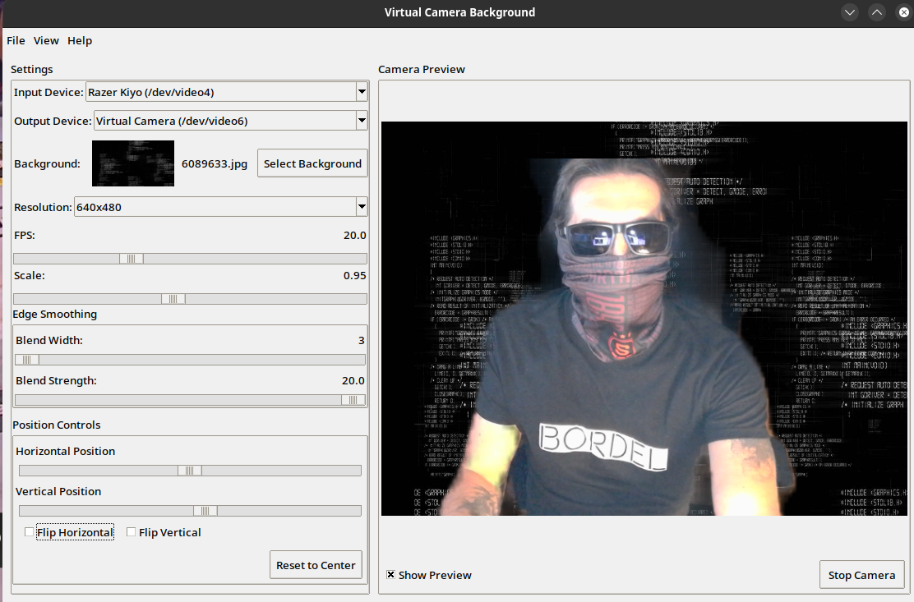

# Virtual Camera Background

A simple application that lets you use custom backgrounds in any video call, even if your video chat app doesn't support this feature. Works with Signal, Zoom, Teams, Meet, and any other video conferencing software.

> [!TIP]
> For one-file version switch to  branch



## Features

- Real-time background replacement
- Multiple segmentation models (landscape/portrait)
- Adjustable smoothing and scaling
- Save/Load/Import/Export settings
- Preview window
- Support for multiple camera resolutions
- Works with any v4l2loopback virtual camera

## Prerequisites

### System Requirements

- Linux system with Python 3.8+
- Webcam compatible with V4L2
- Graphics acceleration recommended

### Dependencies Installation

Choose your distribution and run the appropriate install script:

```bash
# Arch Linux
./install/arch.sh

# Ubuntu/Debian
./install/debian.sh

# Fedora
./install/fedora.sh
```
This will install all required system packages:
- OpenCV (python3-opencv/python-opencv)
- MediaPipe (python3-mediapipe/python-mediapipe)
- NumPy (python3-numpy/python-numpy)
- Pillow (python3-pillow/python-pillow)
- v4l2loopback
- v4l-utils
- ffmpeg
- Tkinter
- OpenGL libraries

### Virtual Camera Setup

1. Load v4l2loopback module:

   ```bash
   sudo modprobe v4l2loopback devices=1 video_nr=2 card_label="Virtual Camera" exclusive_caps=1
   ```

2. Make it persistent (optional):

   ```bash
   echo "v4l2loopback" | sudo tee /etc/modules-load.d/v4l2loopback.conf
   echo "options v4l2loopback devices=1 video_nr=2 card_label='Virtual Camera' exclusive_caps=1" | sudo tee /etc/modprobe.d/v4l2loopback.conf
   ```

## Installation

1. Clone the repository:

   ```bash
   git clone https://github.com/sodomak/vcam-bg.git
   cd vcam-bg
   ```

2. Install dependencies:

   ```bash
   ./setup.sh
   ```

3. Run the application:

   ```bash
   ./vcam-bg
   ```

## Usage

1. Select your input camera from the dropdown
2. Select virtual camera as output (/dev/video2 by default)
3. Choose a background image
4. Adjust settings as needed:

   - Model: Landscape/Portrait based on your usage
   - FPS: Higher values for smoother video
   - Scale: Adjust output resolution
   - Smoothing: Adjust edge detection sensitivity

5. Click Start to begin
6. Select "Virtual Camera" in your video conferencing software

## Configuration

Settings are automatically saved to `~/.config/vcam-bg/config.json`

You can export/import settings through the File menu.

## Troubleshooting

### Common Issues

1. Virtual camera not showing up:

   ```bash
   # Check if module is loaded
   lsmod | grep v4l2loopback

   # Check available video devices
   v4l2-ctl --list-devices
   ```

2. Permission denied:

   ```bash
   # Add user to video group
   sudo usermod -a -G video $USER
   ```

3. Poor performance:

   - Lower the resolution
   - Reduce FPS
   - Adjust scale factor

## Debug Information

Run with debug output:

```bash
PYTHONPATH=src DEBUG=1 ./vcam-bg
```

## Contributing

Pull requests are welcome. For major changes, please open an issue first.

## License

[MIT](https://choosealicense.com/licenses/mit/)
